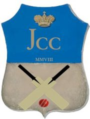

<div align="center">
  

  # [Jyväskylä Cricket Club Ry](https://cricketjyvaskyla.com)

  [](https://astro.build)
</div>

---

## 🚀 Tech Stack

- **Framework:** [Astro 5](https://astro.build) - Static site generator
- **Styling:** Modern CSS with custom properties
- **Gallery:** [Photoswipe 5](https://photoswipe.com) - Lightbox library
- **Package Manager:** npm

---

## 📂 Project Structure

```
cricketjyvaskyla/
├── src/
│   ├── components/       # Reusable Astro components
│   │   ├── Header.astro
│   │   ├── Footer.astro
│   │   ├── MemberCard.astro
│   │   └── Gallery.astro
│   ├── layouts/          # Page layouts
│   │   └── BaseLayout.astro
│   ├── pages/            # File-based routing
│   │   ├── index.astro
│   │   ├── members.astro
│   │   ├── join_us.astro
│   │   ├── fixtures.astro
│   │   ├── gallery.astro
│   │   ├── contact.astro
│   │   └── expense_form.astro
│   ├── styles/           # Global styles
│   │   └── global.css
│   └── data/             # Structured data (JSON)
│       ├── members.json
│       └── gallery.json
├── public/               # Static assets (served as-is)
│   ├── images/          # Image files
│   ├── pdfs/            # PDF documents
│   └── robots.txt
└── dist/                 # Production build output (generated)
```

---

## 🚦 Getting Started

### Prerequisites

- [Node.js](https://nodejs.org/) v20 or higher
- npm (comes with Node.js)

### Installation

```bash
# Clone the repository
git clone https://github.com/AkshayGuleria/cricketjyvaskyla.git
cd cricketjyvaskyla

# Install dependencies
npm install

# Start development server
npm run dev
```

The site will be available at `http://localhost:4321`

### Build for Production

```bash
# Create production build
npm run build

# Preview production build locally
npm run preview
```

The production build will be in the `dist/` directory.

---

## 📝 Available Scripts

| Command | Description |
|---------|-------------|
| `npm run dev` | Start development server with hot reload at `localhost:4321` |
| `npm run build` | Build site for production to `./dist/` |
| `npm run preview` | Preview production build locally |
| `npm run astro` | Run Astro CLI commands |
| `npm run astro -- --help` | Get help with Astro CLI |

---

## 🎨 Customization

### Update Member Data

Edit `src/data/members.json`:

```json
{
  "executive": [
    {
      "name": "Name",
      "role": "Position",
      "email": "email@example.com"
    }
  ],
  "players": [
    {
      "name": "Player Name",
      "role": "Captain"
    }
  ]
}
```

### Add Photos to Gallery

Edit `src/data/gallery.json`:

```json
{
  "albums": [
    {
      "id": "album-id",
      "title": "Album Title",
      "description": "Album description",
      "images": [
        {
          "src": "/images/photo.jpg",
          "width": 1920,
          "height": 1080,
          "caption": "Photo caption"
        }
      ]
    }
  ]
}
```

Place image files in `public/images/` - they'll be served from `/images/` in production.

### Modify Styles

Global styles are in `src/styles/global.css` using CSS custom properties:

```css
:root {
  --color-primary: #003580;    /* Primary brand color */
  --color-secondary: #2D5016;  /* Secondary color */
  --color-accent: #DC143C;     /* Accent color */
  /* ... more variables */
}
```

Component-specific styles are in the `<style>` section of each `.astro` file.

---

## 🚀 Deployment

### Build for Production

```bash
npm run build
```

This generates a `dist/` directory with static files ready for deployment.

### Deploy to Any Static Host

The built site in `dist/` can be deployed to any static hosting service:

**Requirements:**
- Serve static files from `dist/` directory
- Support for static routing (or configure redirects)
- HTTPS recommended

**Common Options:**
- Static hosting services (CDN-based)
- Traditional web servers (Apache, Nginx)
- Object storage with static hosting (S3, etc.)

**Important Files:**
- `dist/index.html` - Homepage
- `dist/sitemap-index.xml` - Sitemap for SEO
- `dist/robots.txt` - Search engine directives

### Server Configuration

**For clean URLs** (optional):
Configure your server to handle routes without `.html` extensions:

**Nginx example:**
```nginx
location / {
    try_files $uri $uri.html $uri/ =404;
}
```

**Apache example (.htaccess):**
```apache
RewriteEngine On
RewriteCond %{REQUEST_FILENAME} !-f
RewriteCond %{REQUEST_FILENAME} !-d
RewriteRule ^([^\.]+)$ $1.html [NC,L]
```

---

## 🛠️ Development

### File-Based Routing

Astro uses file-based routing. Files in `src/pages/` become routes:

- `src/pages/index.astro` → `/`
- `src/pages/about.astro` → `/about`
- `src/pages/blog/post.astro` → `/blog/post`

### Components

Create reusable components in `src/components/`:

```astro
---
// Component script (runs at build time)
interface Props {
  title: string;
}
const { title } = Astro.props;
---

<div class="component">
  <h2>{title}</h2>
</div>

<style>
  .component {
    /* Component styles */
  }
</style>
```

### Layouts

Layouts wrap page content. Example from `src/layouts/BaseLayout.astro`:

```astro
---
const { title } = Astro.props;
---

<!DOCTYPE html>
<html lang="en">
  <head>
    <title>{title}</title>
    <!-- meta tags, styles, etc. -->
  </head>
  <body>
    <slot /> <!-- Page content goes here -->
  </body>
</html>
```

### Assets

- **Static files:** Place in `public/` - served as-is
- **Images:** Can use `public/images/` or `src/assets/`
- **Optimized images:** Import from `src/assets/` for optimization

---

## 📚 Documentation Files

- **[DEPLOYMENT.md](DEPLOYMENT.md)** - Detailed deployment guide
- **[TESTING.md](TESTING.md)** - Testing checklist and procedures
- **[CLAUDE.md](CLAUDE.md)** - Project instructions for AI assistance

---

## 🤝 Contributing

### Development Workflow

```bash
# Create a feature branch
git checkout -b feature/your-feature-name

# Make your changes
# Test locally with npm run dev

# Build to verify no errors
npm run build

# Commit changes
git add .
git commit -m "Description of changes"

# Push to GitHub
git push origin feature/your-feature-name

# Create Pull Request on GitHub
```

### Code Style

- Use TypeScript for type safety (`.astro` files support TypeScript)
- Follow existing component structure
- Use CSS custom properties for colors and spacing
- Ensure responsive design (mobile-first)
- Test on multiple screen sizes

---

## 📖 Learn More

### Astro Resources
- [Astro Documentation](https://docs.astro.build)
- [Astro Discord](https://astro.build/chat)
- [Astro GitHub](https://github.com/withastro/astro)

### CSS & Design
- [Modern CSS](https://moderncss.dev/)
- [CSS Custom Properties](https://developer.mozilla.org/en-US/docs/Web/CSS/--*)

---

## 📜 License

This project is maintained by Jyväskylä Cricket Club.

Built with [Astro](https://astro.build) 🚀
